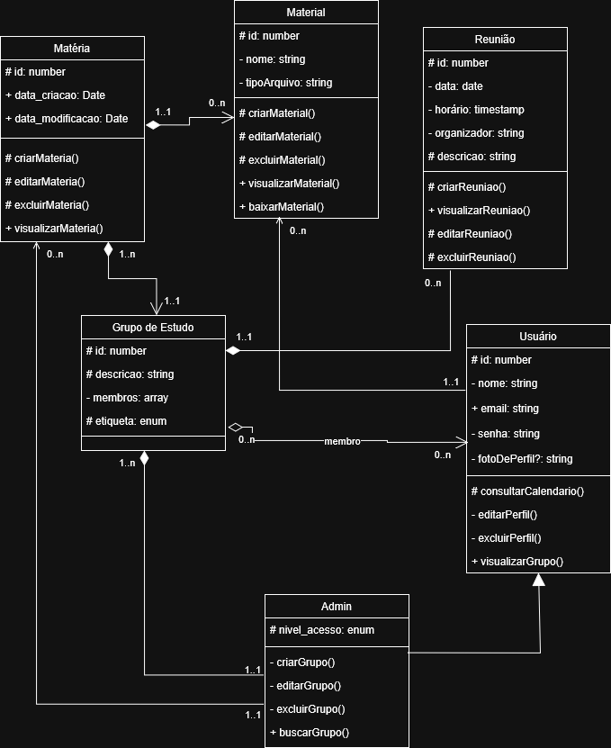

# Módulo UML – Modelagem Estática: Diagrama de Classes

## 1. Introdução

O módulo *Modelagem Estática* tem como finalidade descrever a estrutura estática de um sistema de software, ou seja, os elementos que o compõem e as relações entre eles, sem levar em conta seu comportamento dinâmico. Nesse contexto, foi definido pela equipe que será abordado o Diagrama de Classes como representante principal desse foco da entrega, no qual todos os membros terão sua participação no desenvolvimento e/ou documentação desse diagrama.

O diagrama de classes é um dos principais da UML e representa a estrutura estática de um sistema orientado a objetos, mostrando classes, atributos, métodos e seus relacionamentos. Ele permite visualizar como os elementos do sistema se organizam, servindo de base para o desenvolvimento do software. Cada classe é representada por um retângulo com três partes: nome, atributos e métodos. O diagrama também inclui relacionamentos como associação, agregação, composição, herança e dependência.

 

## 2. Diagrama de Estados

A imagem abaixo apresenta o diagrama completo de estados do sistema, contemplando todos os fluxos modelados:

Imagem 1: Diagrama de Classes

Fonte: [Quadro de Participações](#_5-quadro-de-participações)

## 3. Esquema do diagrama

### 3.1. Classes Principais

- **Matéria**  
  Responsável por representar os temas ou disciplinas cadastradas no sistema. Possui atributos como identificador e datas de criação e modificação. Inclui operações para criar, editar, excluir e visualizar matérias.

- **Material**  
  Representa os conteúdos associados a uma matéria, como arquivos ou documentos. Contém informações como nome e tipo de arquivo, além de métodos para gerenciar esses materiais (criar, editar, excluir, visualizar e baixar).

- **Grupo de Estudo**  
  Entidade central do sistema, representa os grupos formados pelos usuários. Possui descrição, lista de membros e uma etiqueta (categoria). Está relacionado a matérias e usuários, organizando a participação dos membros.

- **Usuário**  
  Representa os participantes do sistema. Armazena dados como nome, e-mail, senha e foto de perfil. Permite ações como consultar calendário, editar ou excluir perfil e visualizar grupos.

- **Reunião**  
  Define os encontros realizados pelos grupos. Contém informações como data, horário, organizador e descrição, além de métodos para criação, edição, exclusão e visualização.

- **Admin**  
  Especialização da classe Usuário, com privilégios adicionais. Possui nível de acesso e pode criar, editar, excluir e buscar grupos.

### 3.2. Relacionamentos

- Uma **Matéria** pode possuir vários **Materiais**, mas cada material pertence a uma única matéria.
- Um **Grupo de Estudo** está associado a uma ou mais matérias.
- Um **Grupo de Estudo** é composto por vários **Usuários**, e um usuário pode participar de vários grupos.
- Um **Grupo de Estudo** pode ter várias **Reuniões**, que são organizadas por usuários.
- A classe **Admin** herda de **Usuário**, adicionando permissões administrativas.

### 3.3. Considerações Gerais

O diagrama organiza de forma clara as responsabilidades de cada classe e como elas interagem. Ele serve como base para o desenvolvimento do sistema, facilitando a compreensão da estrutura e apoiando futuras manutenções e expansões.

 

## 4. Bibliografia

SERRANO, Milene. *05b - VideoAula - DSW-Modelagem - Diagrama de Classe*. Disponível na plataforma Aprender3. Acesso em 24 de Abril de 2026.

Lucidchart. *Diagrama de componentes UML: o que é, como fazer e exemplos?* Disponível em: https://www.lucidchart.com/pages/pt/diagrama-de-componentes-uml. Acesso em 24 de Abril de 2026.

## 5. Quadro de Participações

Tabela 1: Quadro de colaboração da Modelagem Organizacional

| **Aluno**                           | **Participação**                                                  |
|-------------------------------------|-------------------------------------------------------------------|
| Camila Cavalcante                    | Elaboração conjunta do diagrama em [reunião via Microsoft Teams](https://unbarqdsw2026-1-turma02.github.io/2026.01-T02-G2_OrganizeSeuGrupo_Entrega_02/#/Modelagem/2.5.3.DocumentacaoReunioes?id=ata-de-reunião-04) |
| Eduardo de Pina           | [Documentação do artefato e montagem da página no GitHub](https://github.com/UnBArqDsw2026-1-Turma02/2026.01-T02-G2_OrganizeSeuGrupo_Entrega_02/commit/a440282f802ffde95b29d44b141959b735672f72) |
| Gabriel Sampaio Fae             | Elaboração conjunta do diagrama em [reunião via Microsoft Teams](https://unbarqdsw2026-1-turma02.github.io/2026.01-T02-G2_OrganizeSeuGrupo_Entrega_02/#/Modelagem/2.5.3.DocumentacaoReunioes?id=ata-de-reunião-04) |
| Júlio César Costa            | Elaboração conjunta do diagrama em [reunião via Microsoft Teams](https://unbarqdsw2026-1-turma02.github.io/2026.01-T02-G2_OrganizeSeuGrupo_Entrega_02/#/Modelagem/2.5.3.DocumentacaoReunioes?id=ata-de-reunião-04) |
| Lucas Alves Oliveira dos Santos               | Elaboração conjunta do diagrama em [reunião via Microsoft Teams](https://unbarqdsw2026-1-turma02.github.io/2026.01-T02-G2_OrganizeSeuGrupo_Entrega_02/#/Modelagem/2.5.3.DocumentacaoReunioes?id=ata-de-reunião-04) |
| Luísa de Souza Ferreira              | Elaboração conjunta do diagrama em [reunião via Microsoft Teams](https://unbarqdsw2026-1-turma02.github.io/2026.01-T02-G2_OrganizeSeuGrupo_Entrega_02/#/Modelagem/2.5.3.DocumentacaoReunioes?id=ata-de-reunião-04) |
| Marcus Vinicius Cunha Dantas     | Elaboração conjunta do diagrama em [reunião via Microsoft Teams](https://unbarqdsw2026-1-turma02.github.io/2026.01-T02-G2_OrganizeSeuGrupo_Entrega_02/#/Modelagem/2.5.3.DocumentacaoReunioes?id=ata-de-reunião-04) |
| Mayara Marques Silva               | Elaboração conjunta do diagrama em [reunião via Microsoft Teams](https://unbarqdsw2026-1-turma02.github.io/2026.01-T02-G2_OrganizeSeuGrupo_Entrega_02/#/Modelagem/2.5.3.DocumentacaoReunioes?id=ata-de-reunião-04) |
| Pedro Everton de Paula  | Elaboração conjunta do diagrama em [reunião via Microsoft Teams](https://unbarqdsw2026-1-turma02.github.io/2026.01-T02-G2_OrganizeSeuGrupo_Entrega_02/#/Modelagem/2.5.3.DocumentacaoReunioes?id=ata-de-reunião-04) |
| Thiago Viriato Accioly  | Elaboração conjunta do diagrama em [reunião via Microsoft Teams](https://unbarqdsw2026-1-turma02.github.io/2026.01-T02-G2_OrganizeSeuGrupo_Entrega_02/#/Modelagem/2.5.3.DocumentacaoReunioes?id=ata-de-reunião-04) |

<b>Fonte: </b>Autoria de <a href="https://github.com/eduardodpms">Eduardo de Pina</a>

> A ata da reunião de elaboração do diagrama pode ser encontrada em: [Ata da Reunião](https://unbarqdsw2026-1-turma02.github.io/2026.01-T02-G2_OrganizeSeuGrupo_Entrega_02/#/Modelagem/2.5.3.DocumentacaoReunioes?id=ata-de-reunião-04)

 

## 6. Histórico de Versões

| Versão | Data       | Descrição                          | Autor(es)        | Revisor | 
|--------|------------|------------------------------------|------------------| --------|
| 1.0 | 24/04/2026 | Adição da tabela de participações e do histórico de versões | Eduardo de Pina | Júlio César |
| 1.1 | 24/04/2026 | Adição da introdução, referências e diagrama | Eduardo de Pina | Luísa de Souza |