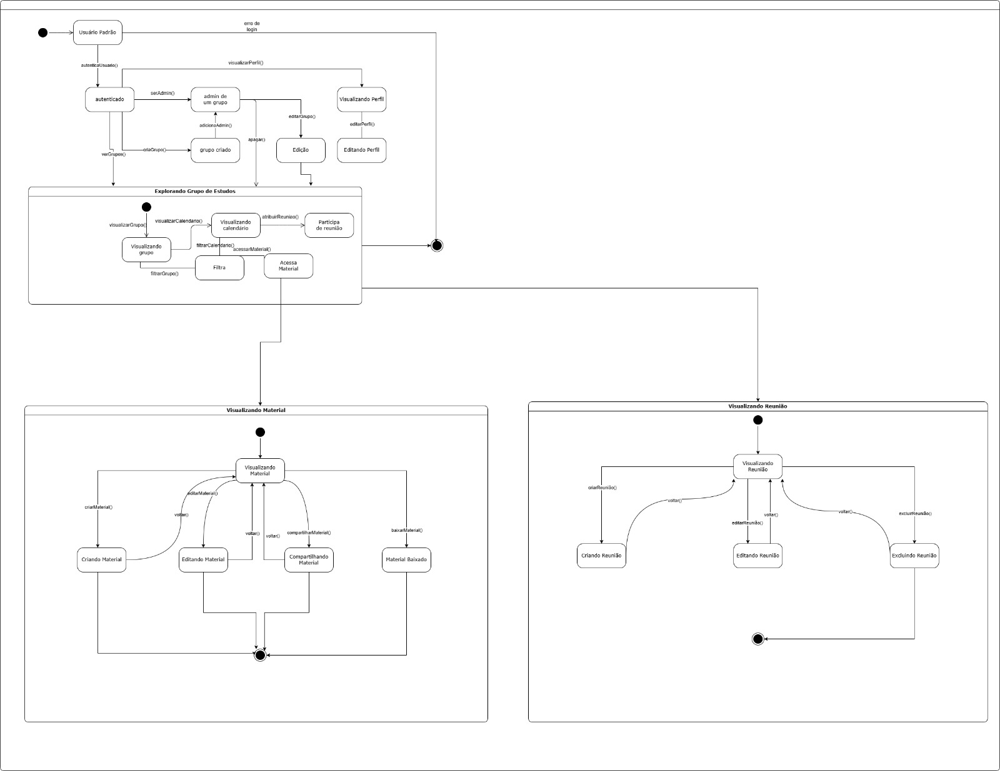
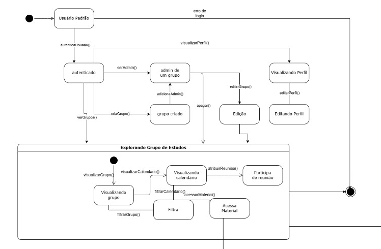
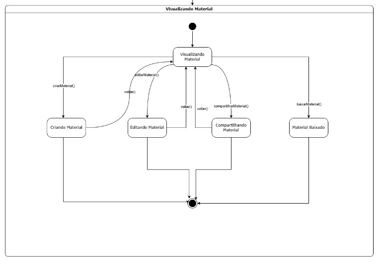
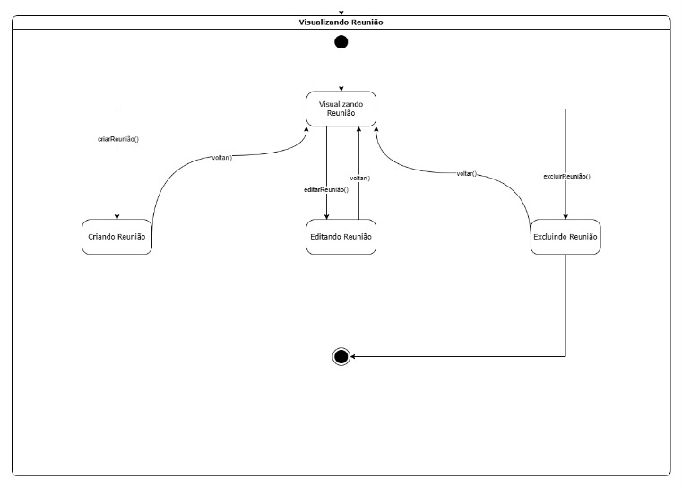
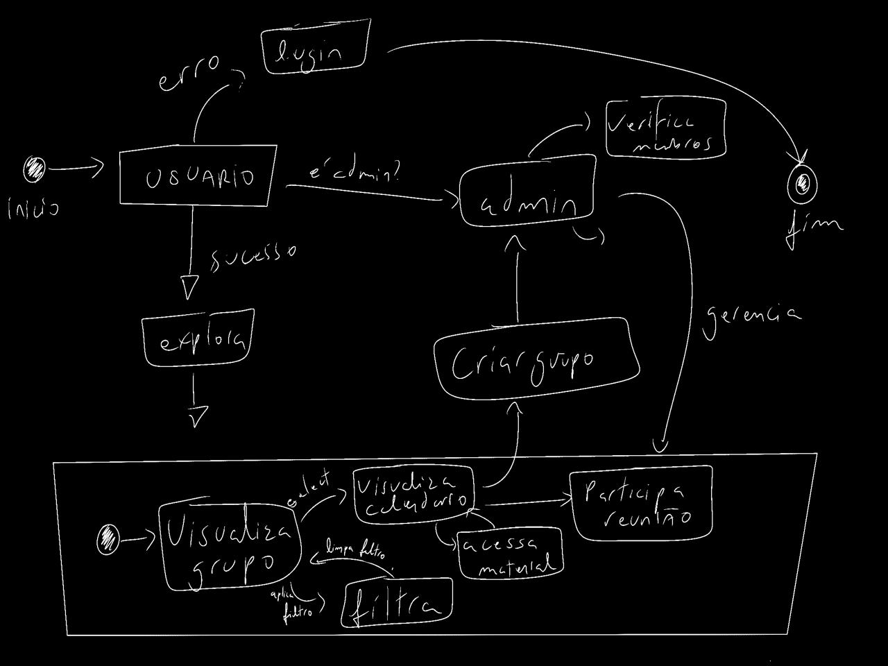

# Modelagem Dinâmica – Diagrama de Estados

## OrganizeseuGrupo

## 1. Introdução

Este documento apresenta o modelo dinâmico desenvolvido pela equipe para o projeto **Organize seu Grupo**, utilizando a notação UML na forma de **Diagrama de Estados** (também conhecido como Diagrama de Máquina de Estados). O objetivo é representar o comportamento dinâmico do sistema, evidenciando como o sistema transita entre diferentes estados em resposta a eventos e ações dos usuários.

O diagrama de estados é especialmente adequado para modelar sistemas reativos, onde o comportamento do sistema depende do estado atual e dos eventos recebidos. No contexto do **Organize seu Grupo**, essa abordagem permite mapear com clareza os fluxos de navegação, as permissões contextuais e as interações entre usuários e grupos de estudo.

---

## 2. Diagrama de Estados

### 2.1 Visão Geral do Diagrama

A imagem abaixo apresenta o diagrama completo de estados do sistema, contemplando todos os fluxos modelados:

---

### 2.2 Parte 1 – Autenticação e Navegação Principal

Esta seção do diagrama cobre o fluxo inicial do sistema. O usuário parte do estado **Usuário Padrão** e, ao executar `autenticaUsuario()`, transita para o estado **autenticado**. A partir daí, os seguintes caminhos estão disponíveis:

- **`serAdmin()`** → transição para *admin de um grupo*, com possibilidade de `adicionaAdmin()` e de apagar o grupo;
- **`criaGrupo()`** → leva ao estado *grupo criado*, com posterior acesso à exploração do grupo;
- **`verGrupos()`** → acesso direto ao submódulo **Explorando Grupo de Estudos**;
- **`visualizarPerfil()`** → leva ao estado *Visualizando Perfil*, de onde é possível editar o perfil via `editarPerfil()`;
- **`editarGrupo()`** → leva ao estado *Edição* do grupo, acesso somente após **`serAdmin`**
- **erro de login** → retorna ao estado inicial *Usuário Padrão*, e finaliza o estado/processo.

No submódulo **Explorando Grupo de Estudos**, o usuário pode:
- Visualizar o grupo (`visualizarGrupo()`);
- Acessar o calendário (`visualizarCalendario()`), com opção de filtrar (`filtrarCalendario()`);
- Atribuir reunião (`atribuirReuniao()`) → *Participa de reunião*;
- Acessar material (`acessarMaterial()`) → entra no submódulo **Visualizando Material**;
- Filtrar grupos (`filtrarGrupo()`).

---

### 2.3 Parte 2 – Visualizando Material

O submódulo **Visualizando Material** é acionado quando o usuário escolhe `acessarMaterial()`. A partir do estado central *Visualizando Material*, as seguintes transições são possíveis:

- **`criarMaterial()`** → *Criando Material*;
- **`editarMaterial()`** → *Editando Material*, com retorno via `voltar()`;
- **`compartilharMaterial()`** → *Compartilhando Material*, com retorno via `voltar()`;
- **`baixarMaterial()`** → *Material Baixado* (estado terminal interno ao submódulo);
- Qualquer caminho pode levar ao estado final do submódulo, encerrando o fluxo de materiais.

---

### 2.4 Parte 3 – Visualizando Reunião

O submódulo **Visualizando Reunião** é ativado quando o usuário participa de uma reunião. A partir do estado *Visualizando Reunião*, os caminhos possíveis são:

- **`criarReuniao()`** → *Criando Reunião*, com retorno via `voltar()`;
- **`editarReuniao()`** → *Editando Reunião*, com retorno via `voltar()`;
- **`excluirReuniao()`** → *Excluindo Reunião*, com retorno via `voltar()`;
- Ao final de qualquer ação, o sistema retorna ao estado final do submódulo (indicado pelo estado final com duplo círculo).

---

## 3. Justificativas e Senso Crítico sobre o Modelo

O **Diagrama de Estados** foi escolhido para modelar o comportamento dinâmico do sistema por ser especialmente adequado à natureza do projeto **Organize seu Grupo**. O sistema possui um fluxo de navegação claramente orientado a estados: o comportamento disponível ao usuário muda conforme o contexto em que ele se encontra (autenticado, dentro de um grupo, visualizando material, etc.).

### Por que Diagrama de Estados?

- **Reatividade contextual**: o sistema responde de forma diferente às mesmas ações dependendo do estado atual. Por exemplo, `voltar()` possui significado distinto dentro de cada submódulo.
- **Hierarquia de estados**: o modelo captura bem a estrutura hierárquica do sistema — estados compostos como *Explorando Grupo de Estudos*, *Visualizando Material* e *Visualizando Reunião* agrupam comportamentos relacionados de forma coesa.
- **Clareza de permissões**: a distinção entre usuário comum e administrador é representada naturalmente pelas transições condicionais (`serAdmin()`), sem necessidade de duplicar o diagrama.

### Pontos fortes do modelo

- **Legibilidade**: a decomposição em submódulos (representados por estados compostos com borda) facilita a leitura e compreensão de cada área funcional separadamente.
- **Completude**: todos os principais fluxos do sistema estão representados — autenticação, gerenciamento de grupos, materiais e reuniões.
- **Fidelidade ao sistema**: as transições nomeadas com as chamadas de método (ex.: `criarMaterial()`, `editarReuniao()`) conferem rastreabilidade direta ao código e aos casos de uso.
- **Facilidade**: por mais que pareça complexo, se destrincha de formas simples ao decorrer do processo de trabalho, sendo de fácil compreensão e modularização.

## 4. Participações e Trabalho em Equipe

### 4.1 Quadro de Participações

<a>Tabela 1:</a> Quadro de colaboração da Modelagem Dinâmica

| **Aluno**                           | **Participação**                                                  |
|-------------------------------------|-------------------------------------------------------------------|
| Camila Cavalcante                    | Elaboração conjunta do diagrama em [reunião via Microsoft Teams](https://unbarqdsw2026-1-turma02.github.io/2026.01-T02-G2_OrganizeSeuGrupo_Entrega_02/#/Modelagem/2.5.3.DocumentacaoReunioes?id=ata-de-reunião-06) |
| Eduardo de Pina           | Elaboração conjunta do diagrama em [reunião via Microsoft Teams](https://unbarqdsw2026-1-turma02.github.io/2026.01-T02-G2_OrganizeSeuGrupo_Entrega_02/#/Modelagem/2.5.3.DocumentacaoReunioes?id=ata-de-reunião-06) |
| Gabriel Sampaio Fae             | Elaboração conjunta do diagrama em [reunião via Microsoft Teams](https://unbarqdsw2026-1-turma02.github.io/2026.01-T02-G2_OrganizeSeuGrupo_Entrega_02/#/Modelagem/2.5.3.DocumentacaoReunioes?id=ata-de-reunião-06) |
| Júlio César Costa            | Elaboração conjunta do diagrama em [reunião via Microsoft Teams](https://unbarqdsw2026-1-turma02.github.io/2026.01-T02-G2_OrganizeSeuGrupo_Entrega_02/#/Modelagem/2.5.3.DocumentacaoReunioes?id=ata-de-reunião-06) |
| Lucas Alves Oliveira dos Santos               | Elaboração conjunta do diagrama em [reunião via Microsoft Teams](https://unbarqdsw2026-1-turma02.github.io/2026.01-T02-G2_OrganizeSeuGrupo_Entrega_02/#/Modelagem/2.5.3.DocumentacaoReunioes?id=ata-de-reunião-06) |
| Luísa de Souza Ferreira              | Elaboração conjunta do diagrama em [reunião via Microsoft Teams](https://unbarqdsw2026-1-turma02.github.io/2026.01-T02-G2_OrganizeSeuGrupo_Entrega_02/#/Modelagem/2.5.3.DocumentacaoReunioes?id=ata-de-reunião-06) |
| Marcus Vinicius Cunha Dantas     | Elaboração conjunta do diagrama em [reunião via Microsoft Teams](https://unbarqdsw2026-1-turma02.github.io/2026.01-T02-G2_OrganizeSeuGrupo_Entrega_02/#/Modelagem/2.5.3.DocumentacaoReunioes?id=ata-de-reunião-06) |
| Mayara Marques Silva               | Elaboração conjunta do diagrama em [reunião via Microsoft Teams](https://unbarqdsw2026-1-turma02.github.io/2026.01-T02-G2_OrganizeSeuGrupo_Entrega_02/#/Modelagem/2.5.3.DocumentacaoReunioes?id=ata-de-reunião-06) |
| Pedro Everton de Paula  | Elaboração conjunta do diagrama em [reunião via Microsoft Teams](https://unbarqdsw2026-1-turma02.github.io/2026.01-T02-G2_OrganizeSeuGrupo_Entrega_02/#/Modelagem/2.5.3.DocumentacaoReunioes?id=ata-de-reunião-06) |
| Thiago Viriato Accioly  | Elaboração conjunta do diagrama em [reunião via Microsoft Teams](https://unbarqdsw2026-1-turma02.github.io/2026.01-T02-G2_OrganizeSeuGrupo_Entrega_02/#/Modelagem/2.5.3.DocumentacaoReunioes?id=ata-de-reunião-06) |

<b>Fonte: </b>Autoria de <a href="https://github.com/eduardodpms">Eduardo de Pina</a>

> A ata da reunião de elaboração do diagrama pode ser encontrada em: [Ata da Reunião](https://unbarqdsw2026-1-turma02.github.io/2026.01-T02-G2_OrganizeSeuGrupo_Entrega_02/#/Modelagem/2.5.3.DocumentacaoReunioes?id=ata-de-reunião-06)

### 4.2 Processo de Construção

Todos os participantes do grupo desenvolveram o diagrama juntos em reunião realizada via **Microsoft Teams**. Durante a sessão, as opiniões foram levantadas livremente, e a equipe utilizou **esboços feitos à mão** para definir a lógica e estrutura do diagrama antes de partir para a versão digital. Essa abordagem colaborativa garantiu que todos compreendessem e contribuíssem para o modelo final.

### 4.3 Comentários sobre o Trabalho em Equipe

O desenvolvimento desta etapa foi trabalhoso e demandou dedicação do grupo, especialmente na fase de alinhamento conceitual sobre o que deveria ser representado no diagrama. Contudo, com base nos **materiais disponibilizados pela disciplina** e em **pesquisas complementares** realizadas pela equipe, foi possível construir um diagrama consistente e representativo do sistema. A experiência reforçou a importância da comunicação ativa entre os membros e do uso de ferramentas colaborativas para garantir a qualidade das entregas.

---

## 5. Referências Bibliográficas

- LUCIDCHART. **O que é diagrama de máquina de estados UML?** Disponível em: [https://www.lucidchart.com/pages/pt/o-que-e-diagrama-de-maquina-de-estados-uml](https://www.lucidchart.com/pages/pt/o-que-e-diagrama-de-maquina-de-estados-uml). Acesso em: 23 abr. 2026.

- ABDALA, D. **Diagrama de Estados**. Universidade Federal de Uberlândia – FACOM. Disponível em: [https://www.facom.ufu.br/~abdala/DAS5312/Diagrama%20de%20Estados.pdf](https://www.facom.ufu.br/~abdala/DAS5312/Diagrama%20de%20Estados.pdf). Acesso em: 23 abr. 2026.

## Histórico de Versões

| Versão | Data       | Descrição                          | Autor(es)        | Revisor | 
|--------|------------|------------------------------------|------------------| --------|
| 1.0    | 23/04/2026 | Criação do documento e do diagrama | Gabriel Fae | Mayara Marques |
| 1.1    | 24/04/2026 | Adição de link da ata de reunião | Eduardo de Pina | Mayara Marques |