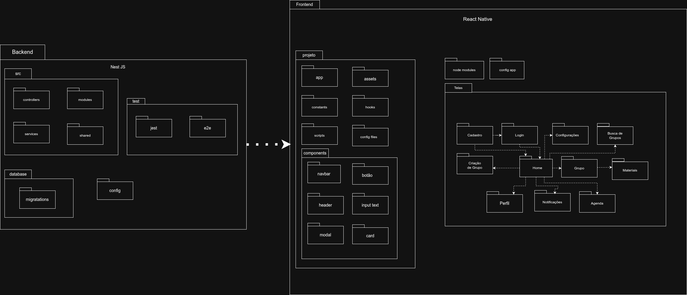

# 2.3. Módulo Notação UML – Modelagem Organizacional OU Casos de Uso

## 2.3.1. Diagrama de Pacotes

### Introdução
O diagrama de pacotes apresenta uma visão hierárquica do projeto, mostrando dependências entre módulos, ajudam a promover um design modular e planejar um código mais organizado.

### Elementos
Os principais elementos de um diagrama de pacotes são:

- Pacote (Package): Representado pelo ícone de uma pastinha. A ideia dele é simplesmente agrupar as coisas que fazem sentido juntas. No nosso projeto, usamos os pacotes para duas coisas, separar as grandes áreas (como frontend e backend) e representar a organização real das nossas pastas no código.

- Dependência (Dependency): É a setinhas que utilizamos, no caso a tracejada. Ela serve para mostrar que um pacote precisa do outro para conseguir funcionar. A gente usou isso para montar o fluxo do aplicativo (Exemplo: tela de *Login* para a tela *Home*) e para deixar claro que o nosso Frontend depende do Backend para salvar os dados.

- Importação (Import): É a setinha de dependência com tag <<import>>. Basicamente, mostra que um pacote tá puxando o conteúdo de outro para usar abertamente.

- Acesso (Access): É bem parecido com a importação, mas usa a tag `<<access>>` para indicar um acesso mais restrito e privado. Ele mostra que um pacote usa as funções do outro só internamente, sem expor isso para o resto do sistema.

### Diagrama

<b>Fonte:</b> Autoria de Todos.

#### Frontend

O frontend será feito em React Native, focando especialmente em uma aplicação mobile, mas com possibilidade de uma aplicação web. O frontend do react por padrão define os seguintes pacotes:

- `app/`: usa roteamento por arquivos usando Expo Router, todos os arquivos JavaScript ou TypeScript que serão servidos ao usuário estão contidos nesta pasta;
- `assets/`: aqui contém arquivos estáticos (imagens, ícones, fontes);
- `hooks/`: criação de hooks do React, possibilitando reusabilidade de componentes;
- `scripts/`: aqui contém roteiros de utilidade usados para o desenvolvimento;
- `components/`: contém elementos reusáveis como navbar, botão, header, input, modal, card;
- `constants/`: usado para definir variáveis globais, cores, dimensões, espaçamentos, garantindo consistência na aplicação.

Além disso, foi definido algumas telas essenciais no frontend:

- *Tela de Cadastro*: acessada através da tela Home, pode levar a tela de Login;
- *Tela de Login*: acessada através da tela Home ou a tela de cadastro;
- *Tela de Configurações*: acessada através da tela Home, contém as configurações do usuário e do aplicativo;
- *Tela de Busca de Grupos*: acessada através da tela Home;
- *Tela de Grupo*: acessada através da tela Home, mostra um grupo em específico, pode levar até a tela de materiais;
- *Tela de Materiais*: acessada através da tela de Grupo, lista os materiais disponíveis no grupo;
- *Tela de Perfil*: acessada através da tela Home, contém o perfil do usuário;
- *Tela de Notificações*: acessada através da tela Home, contém as notificações recebidas (reuniões planejadas, materiais novos, etc.);
- *Tela de Agenda*: acessada através da tela Home, contém o cronograma do usuário mostrando as próximas reuniões.

#### Backend

O nosso servidor foi estruturando utilizando o NestJs, seguindo uma lógica de módulos para manter o código organizado e fácil de ser mantido. A ideal é que cada parte do sistema code de uma tarefa específica.

- *Controllers*: São os responsáveis por receber as chamadas(pedidos) do aplicativo e devolver uma resposta para o "aluno" ou "professor". Eles funcionam como "roteadores" que decide para onde o pedido deve ir. Porém, não resolvem o pedido sozinho, apenas passam a informação para frente.
- *Services*: É a camada onde resite a lógica de negócio central da nossa aplicação. No NestJs, os serviços são tratados como providers e depois são concebidos para serem injetados como dependência nos controladores, para executar as tarefas mais complexas com validações.
- *Modules*: O NestJs organiza o código por módulos. Cada módulo é uma classe que agrupa coisas que fazem sentido estarem juntas (como controladores e serviços de tem uma mesma funcionalidade), servindo para organizar a estrutura da aplicação.
- *Shared*: É o espaço para guardar as coisas compartilhadas. Se existe um codigo, utilizario ou serviço generico que é uysado em várias partes diferentes do sistema, colocamos aqui para não ficar repetindo à toa o codigo. A ideia é que, se criarmos uma fuinconalidade que precise ser usada em vários outros pontos do codigo, nos apenas exportamos.

### Camadas de Dados e Infraestrutura

- *DataBase (Migrations)*: Está pasta serve para controlar a evolução da estrutura de dados da aplicação. As migrations funcionam praticamente como um histórico, garantido que toda a equipe tenha a base de dados configurada exatamente da mesma forma para todos os computadores.
- *Config*: Funciona como o cofre do projeto. Aqui guardamos as variáveis de ambiente, configurações globais e chaves de segurança, garantido que essas informações sensíveis fiquem bem separadas do código-fonte principal.
- *Test*: É o nosso espaço de garantia de qualidade. Para evitar que o sistema quebre quando alguém adicionar um código novo, é mais fácil centralizar os roteiros de teste em um lugar só. Isso inclui desde os testes mais pequenos (unitários) até os testes mais complex.

### 2.3.1.5 Referências Bibliográficas

> [<a id='ref1'>1</a>] UML DIAGRAMS. *Package Diagrams Overview. UML Diagrams*, 2009. Disponível em: <https://www.uml-diagrams.org/package-diagrams-overview.html>. Acesso em: 23 abr. 2026.

> [<a id='ref2'>2</a>] NESTJS. NestJS - A progressive Node.js framework. [S. l.], 2026. Disponível em: https://docs.nestjs.com/. Acesso em: 23 abr. 2026.

> [<a id='ref3'>3</a>] EXPO. Start developing. [S. l.], 2026. Disponível em: https://docs.expo.dev/get-started/start-developing/. Acesso em: 23 abr. 2026.

> [<a id='ref4'>4</a>]* NESTJS. Database*. [S. l.], 2026. Disponível em: https://docs.nestjs.com/techniques/database. Acesso em: 23 abr. 2026.

> [<a id='ref5'>5</a>]* NESTJS. Configuration*. [S. l.], 2026. Disponível em: https://docs.nestjs.com/techniques/configuration. Acesso em: 23 abr. 2026.

> [<a id='ref6'>6</a>]* NESTJS. Testing*. [S. l.], 2026. Disponível em: https://docs.nestjs.com/fundamentals/testing. Acesso em: 23 abr. 2026.

## Participações e Trabalho em Equipe

### Quadro de Participações

<a>Tabela 1:</a> Quadro de colaboração da Modelagem Organizacional

| **Aluno**                           | **Participação**                                                  |
|-------------------------------------|-------------------------------------------------------------------|
| Camila Cavalcante                    | Elaboração conjunta do diagrama em [reunião via Microsoft Teams](https://unbarqdsw2026-1-turma02.github.io/2026.01-T02-G2_OrganizeSeuGrupo_Entrega_02/#/Modelagem/2.5.3.DocumentacaoReunioes?id=ata-de-reunião-07) |
| Eduardo de Pina           | Elaboração conjunta do diagrama em [reunião via Microsoft Teams](https://unbarqdsw2026-1-turma02.github.io/2026.01-T02-G2_OrganizeSeuGrupo_Entrega_02/#/Modelagem/2.5.3.DocumentacaoReunioes?id=ata-de-reunião-07) |
| Gabriel Sampaio Fae             | [Documentação do artefato e elaboração da página no GitHub]() |
| Júlio César Costa            | [Documentação do artefato e elaboração da página no GitHub](https://github.com/UnBArqDsw2026-1-Turma02/2026.01-T02-G2_OrganizeSeuGrupo_Entrega_02/commit/204bbfe67f0b3b32fd5ef2843a8be50b0c98728e) |
| Lucas Alves Oliveira dos Santos               | Elaboração conjunta do diagrama em [reunião via Microsoft Teams](https://unbarqdsw2026-1-turma02.github.io/2026.01-T02-G2_OrganizeSeuGrupo_Entrega_02/#/Modelagem/2.5.3.DocumentacaoReunioes?id=ata-de-reunião-07) |
| Luísa de Souza Ferreira              | Elaboração conjunta do diagrama em [reunião via Microsoft Teams](https://unbarqdsw2026-1-turma02.github.io/2026.01-T02-G2_OrganizeSeuGrupo_Entrega_02/#/Modelagem/2.5.3.DocumentacaoReunioes?id=ata-de-reunião-07) |
| Marcus Vinicius Cunha Dantas     | Elaboração conjunta do diagrama em [reunião via Microsoft Teams](https://unbarqdsw2026-1-turma02.github.io/2026.01-T02-G2_OrganizeSeuGrupo_Entrega_02/#/Modelagem/2.5.3.DocumentacaoReunioes?id=ata-de-reunião-07) |
| Mayara Marques Silva               | Elaboração conjunta do diagrama de pacotes em [reunião via Microsoft Teams](https://unbarqdsw2026-1-turma02.github.io/2026.01-T02-G2_OrganizeSeuGrupo_Entrega_02/#/Modelagem/2.5.3.DocumentacaoReunioes?id=ata-de-reunião-07) e Elaboração do Diagrama de Casos de Uso |
| Pedro Everton de Paula  | Elaboração conjunta do diagrama em [reunião via Microsoft Teams](https://unbarqdsw2026-1-turma02.github.io/2026.01-T02-G2_OrganizeSeuGrupo_Entrega_02/#/Modelagem/2.5.3.DocumentacaoReunioes?id=ata-de-reunião-07) |
| Thiago Viriato Accioly  | Elaboração conjunta do diagrama em [reunião via Microsoft Teams](https://unbarqdsw2026-1-turma02.github.io/2026.01-T02-G2_OrganizeSeuGrupo_Entrega_02/#/Modelagem/2.5.3.DocumentacaoReunioes?id=ata-de-reunião-07) |

<b>Fonte: </b>Autoria de <a href="https://github.com/maymarquee">Mayara Marques</a> e <a href="https://github.com/eduardodpms">Eduardo de Pina</a>

> A ata da reunião de elaboração do diagrama pode ser encontrada em: [Ata da Reunião](https://unbarqdsw2026-1-turma02.github.io/2026.01-T02-G2_OrganizeSeuGrupo_Entrega_02/#/Modelagem/2.5.3.DocumentacaoReunioes?id=ata-de-reunião-07)

### Processo de Construção

Todos os participantes do grupo desenvolveram o diagrama juntos em reunião realizada via **Microsoft Teams**. Durante a sessão, as opiniões foram levantadas livremente, e a equipe utilizou **esboços feitos à mão** para definir a lógica e estrutura do diagrama antes de partir para a versão digital. Essa abordagem colaborativa garantiu que todos compreendessem e contribuíssem para o modelo final.

## Histórico de Versão

| Versão | Data | Descrição | Autor | Revisor |
| :--- | :--- | :--- | :--- | :--- |
| 1.0   | 23/04/2026 | Documentação da Introdução, Frontend e Reunião   | [Julio Cesar](https://github.com/julnox)               | [Marcus Vinicius](https://github.com/MarcusVcd)         |
| 1.1   | 23/04/2026 | Documentação dos Elementos, Backend e Camada de Dados   | [Marcus Vinicius](https://github.com/MarcusVcd)               | [Julio Cesar](https://github.com/julnox)         |
| 1.2   | 24/04/2026 | Inserção e documentação do diagrama de casos de uso   | [Mayara Marques](https://github.com/maymarquee)               | [Gabriel Fae](https://github.com/faehzin)         |
| 1.3   | 24/04/2026 | Ajustes no Diagrama de Casos de Uso e referências bibliográficas   | [Mayara Marques](https://github.com/maymarquee)               | [Camila Silva](https://github.com/camilasilvac)         |
| 1.4   | 24/04/2026 | Ajuste no quadro de participação   | [Eduardo de Pina](https://github.com/eduardodpms)               | [Gabriel Fae](https://github.com/faehzin)         |
| 1.5   | 24/04/2026 | Ajuste no quadro de participação   | [Mayara Marques](https://github.com/maymarquee)               | [Eduardo de Pina](https://github.com/eduardodpms)         |
| 1.6   | 24/04/2026 | Criação de página própria para Diagrama de Casos de Uso   | [Eduardo de Pina](https://github.com/eduardodpms)               | [Mayara Marques](https://github.com/maymarquee)         |