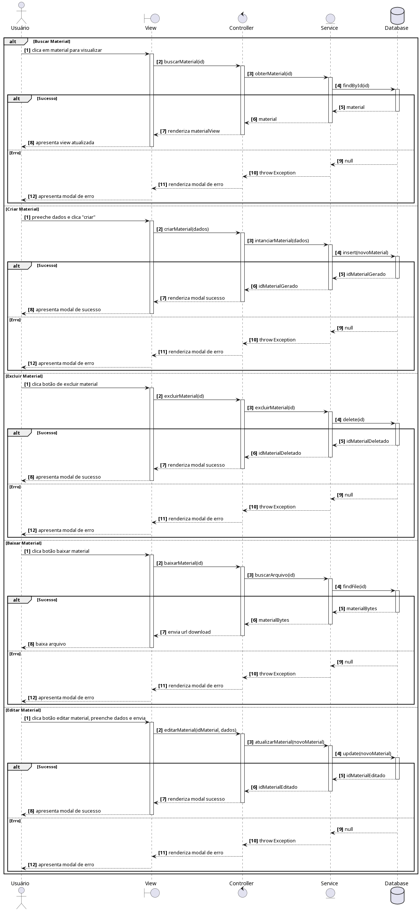

# 2.5.1. Diagrama de Sequências (Materiais)

Como iniciativa extra, o Marcus e Júlio fizeram o diagrama de sequência exemplificando como funcionará a lógica de operações com materiais na aplicação (documentos, imagens, etc.)

<b>Fonte:</b> Autoria de <a href="https://github.com/julnox">Júlio César</a> e <a href="https://github.com/MarcusVcd">Marcus Vinicius Cunha</a>.

## Histórico de Versões:

| Versão | Data | Descrição | Autor | Revisor |
| :--- | :--- | :--- | :--- | :--- |
| 1.0   | 23/04/2026 | Adiciona diagrama de sequências   | [Julio Cesar](https://github.com/julnox)               | [Marcus Vinicius](https://github.com/MarcusVcd)         |
| 1.1 | 24/04/2026 | Modularização das iniciativas extras em arquivos separados | [Eduardo de Pina](https://github.com/eduardodpms) | [Thiago Viriato Accioly](https://github.com/Acciolyy) | 