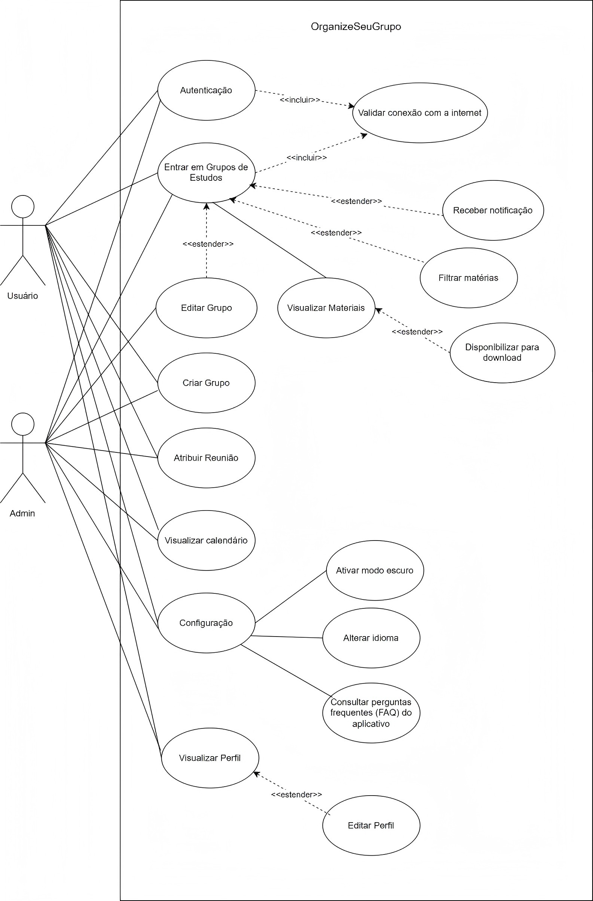

# 2.5.5. Diagrama de Casos de Uso

## Introdução

Este documento apresenta o Diagrama de Casos de Uso do sistema, servindo como uma representação visual das interações entre os atores e as funcionalidades principais. A estrutura deste diagrama segue as definições da Unified Modeling Language (UML), onde os casos de uso são utilizados para descrever o comportamento do sistema sem detalhar sua implementação interna (UML-Diagrams.org). Ao mapear os requisitos funcionais desta forma, estabelecemos uma visão clara do escopo do projeto e de como os usuários finais atingirão seus objetivos (UML-Diagrams.org).

## Elementos

Os principais elementos utilizados no diagrama de casos de uso são:

- Ator (Actor): representa um papel externo que interage com o sistema, como aluno, professor e administrador.
- Caso de Uso (Use Case): representa uma funcionalidade oferecida pelo sistema para atender a um objetivo do ator.
- Fronteira do Sistema (System Boundary): delimita o que pertence ao sistema OrganizeSeuGrupo e o que está fora dele.
- Associação (Association): ligação entre ator e caso de uso, indicando que há interação.
- Inclusão/Extensão (`<<include>>` / `<<extend>>`): relacionamentos para organizar comportamentos obrigatórios e opcionais entre casos de uso.

## Diagrama

Figura 2: Diagrama de Casos de uso

<b>Fonte:</b> <a href="https://github.com/maymarquee">Mayara Marques</a>.

## Descrição dos Casos de Uso

Com base no diagrama elaborado, os casos de uso cobrem os principais fluxos da plataforma, com destaque para:

- Autenticação e acesso: cadastro, login e recuperação de acesso.
- Gestão de grupos: criação, busca, entrada e visualização de grupos de estudo.
- Organização acadêmica: cadastro e consulta de materiais, além de planejamento de reuniões.
- Interação entre membros: notificações, acompanhamento de agenda e visualização de atualizações.
- Administração de conta: edição de perfil e configurações do usuário.

## Referências Bibliográficas

> [<a id='ref7'>7</a>] UML DIAGRAMS. *UML Use Case Diagrams: Overview*. Disponível em: <https://www.uml-diagrams.org/use-case-diagrams.html>. Acesso em: 24 abr. 2026.

## Tabela de Contribuição

<a>Tabela 1:</a> Quadro de colaboração do Diagrama de Casos de Uso

| **Aluno**                           | **Participação**                                                  |
|-------------------------------------|-------------------------------------------------------------------|
| Eduardo de Pina Moreira Santos               | Modularização da página no [GitHub]() |
| Mayara Marques Silva               | Elaboração do Diagrama de Casos de Uso e da página no [GitHub](https://github.com/UnBArqDsw2026-1-Turma02/2026.01-T02-G2_OrganizeSeuGrupo_Entrega_02/commit/26e1a70dbfff1259caf245a722a1e77dbe50cf36) |

<b>Fonte: </b>Autoria de <a href="https://github.com/maymarquee">Mayara Marques</a> e <a href="https://github.com/eduardodpms">Eduardo de Pina</a>

 

## Histórico de Versões:

| Versão | Data | Descrição | Autor | Revisor |
| :--- | :--- | :--- | :--- | :--- |
| 1.0   | 24/04/2026 | Adiciona diagrama de sequências   |  [Mayara Marques](https://github.com/maymarquee)               |  [Eduardo de Pina](https://github.com/eduardodpms)        |
| 1.1   | 24/04/2026 | Separação das páginas de focos e extras   | [Eduardo de Pina](https://github.com/eduardodpms)               | [Mayara Marques](https://github.com/maymarquee)         |

